# 💍 Wedding By Prasami – Cinematic Wedding Photography Website UI/UX Design

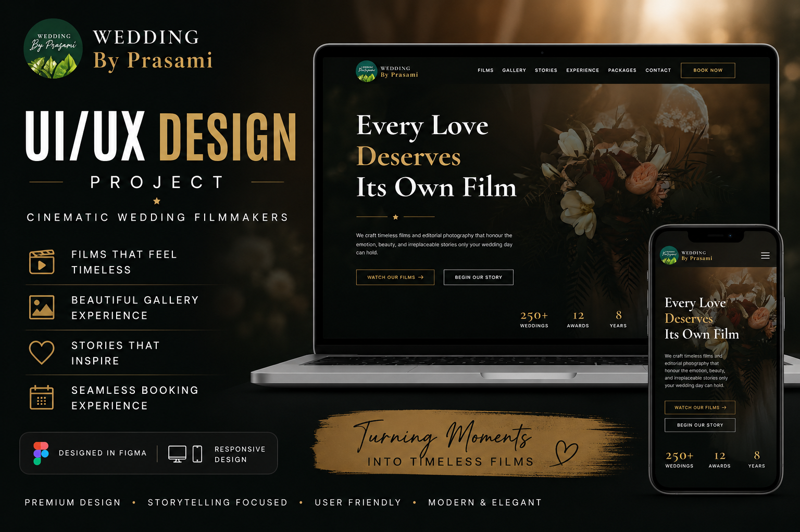

## 📌 Project Overview

Wedding By Prasami is a modern and cinematic wedding photography and filmmaking website UI/UX design created to showcase wedding films, photography, stories, packages, and booking experiences.

The design focuses on emotional storytelling, premium visual aesthetics, elegant typography, cinematic imagery, and a smooth user experience across both desktop and mobile devices.

## 🎯 Project Goal

The goal of this project was to create a premium digital experience for Wedding By Prasami that:

- Creates a strong cinematic first impression
- Showcases wedding films and photography beautifully
- Communicates the brand's storytelling approach
- Helps users explore services and packages easily
- Provides a simple booking and enquiry experience
- Delivers a consistent experience across desktop and mobile devices

## 👥 Target Users

- Couples planning their wedding
- Couples looking for wedding photographers
- Customers searching for cinematic wedding films
- Users exploring wedding photography portfolios
- Customers interested in photography packages
- Users looking to enquire or book wedding services

## 🧠 Design Process

1. Understanding the brand and target audience
2. Planning the website structure
3. Creating the user flow
4. Wireframing
5. High-fidelity UI design
6. Desktop UI design
7. Mobile UI design
8. Responsive design
9. Interactive prototyping
10. Final presentation and mockups

## 📱 Key Features

### 🎬 Home Page

- Cinematic hero section
- Brand introduction
- Featured wedding films
- Photography highlights
- Brand experience
- Testimonials
- Clear call-to-action buttons

### 🎥 Films

A dedicated section for showcasing cinematic wedding films and memorable wedding moments.

### 📸 Gallery

A visually rich photography gallery designed to showcase wedding moments, couples, ceremonies, and celebrations.

### ❤️ Stories

A storytelling section that presents real wedding experiences and emotional moments through photography and written content.

### ✨ Experience

A dedicated section explaining the Wedding By Prasami photography and filmmaking experience, from consultation to final delivery.

### 📦 Packages

A clear presentation of wedding photography and filmmaking packages, services, and package details.

### 📅 Contact & Booking

A simple and user-friendly booking experience that allows potential customers to submit enquiries and provide their wedding details.

---

# 🖥️ Desktop Design

The desktop experience is designed with a cinematic and immersive layout that makes full use of large screens.

### Desktop Highlights

- Full-width cinematic hero section
- Large photography and video visuals
- Horizontal navigation
- Spacious content layouts
- Large typography
- Portfolio-focused sections
- Interactive hover states
- Clear CTA placement
- Premium visual presentation

### Desktop Screens

#### 🏠 Home Page

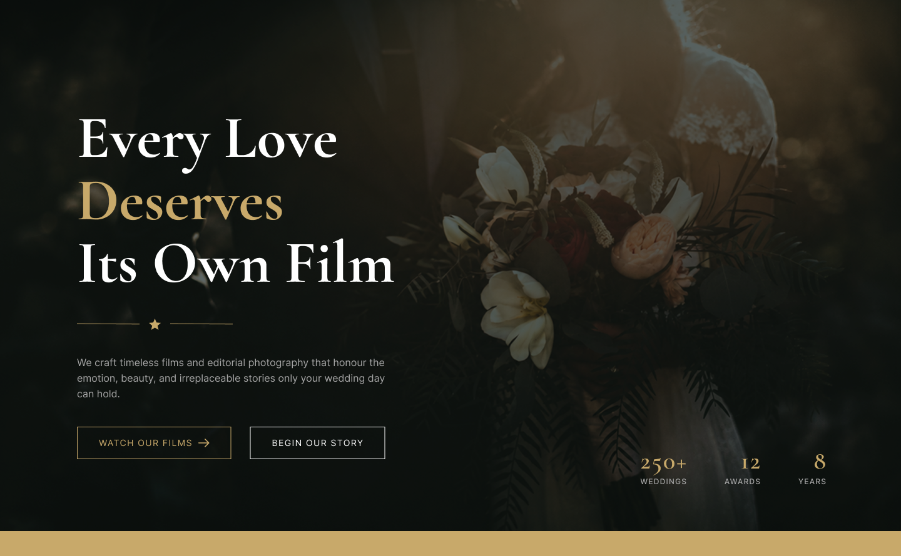

#### 🎥 Films

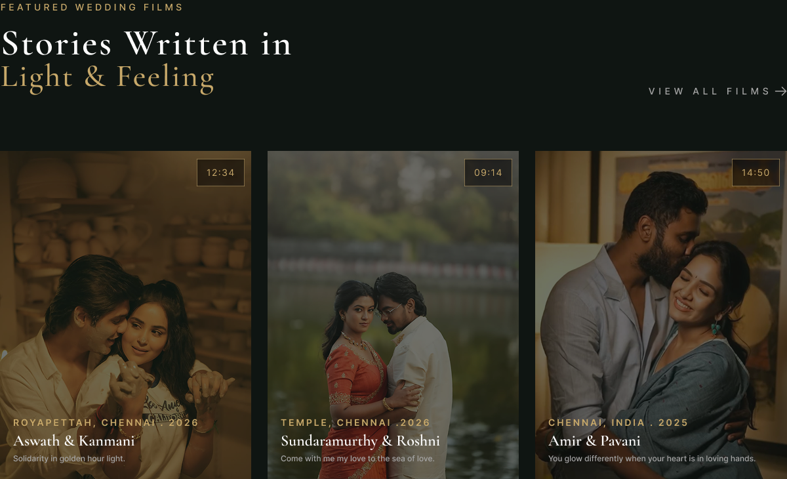

#### 📸 Gallery

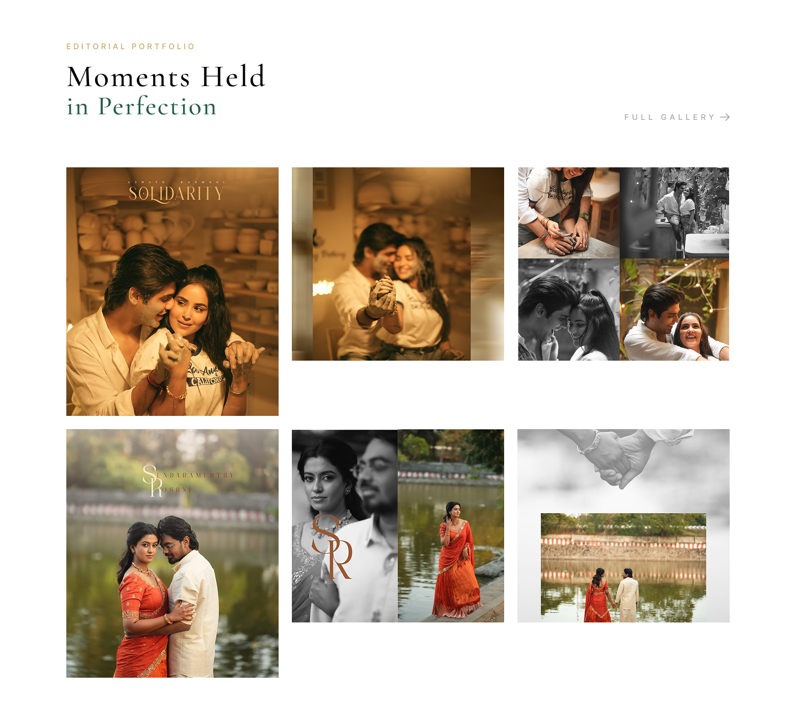

#### ❤️ Stories

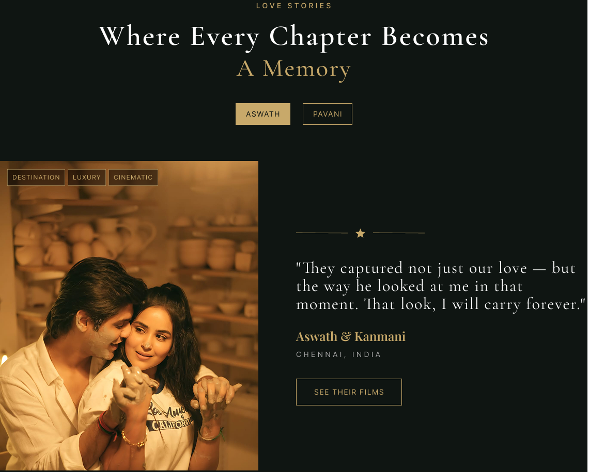

#### ✨ Experience

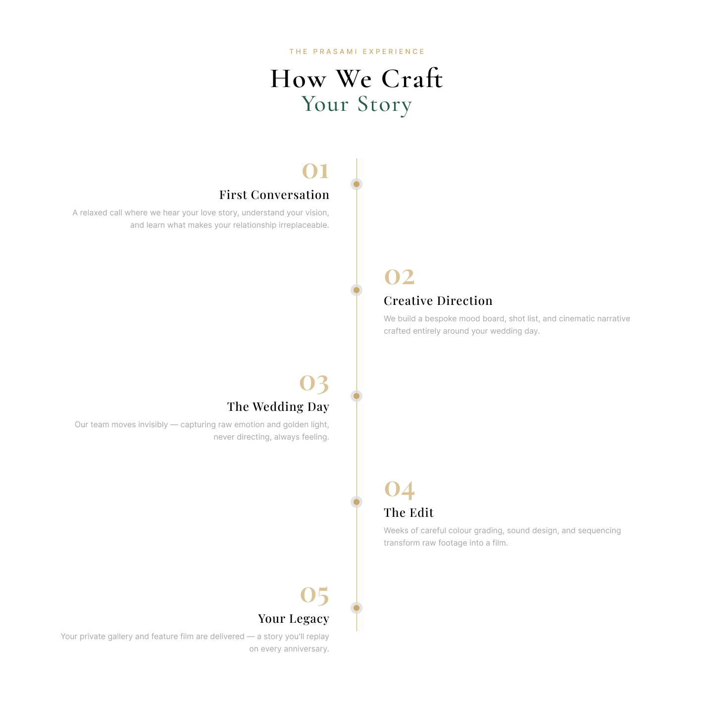

#### 📦 Packages

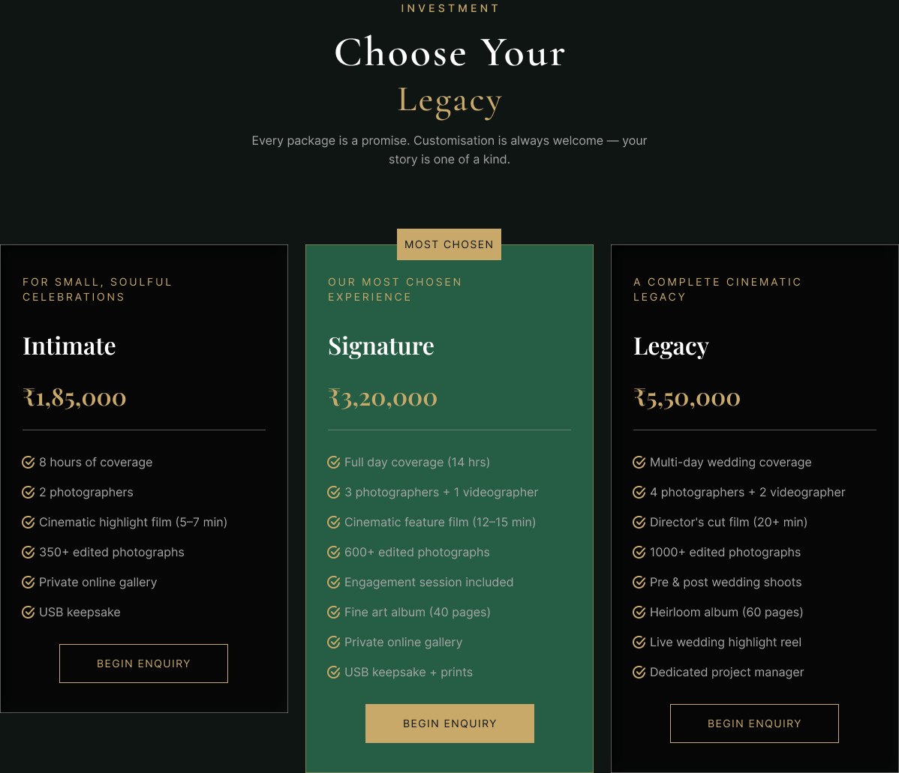

#### 📅 Contact

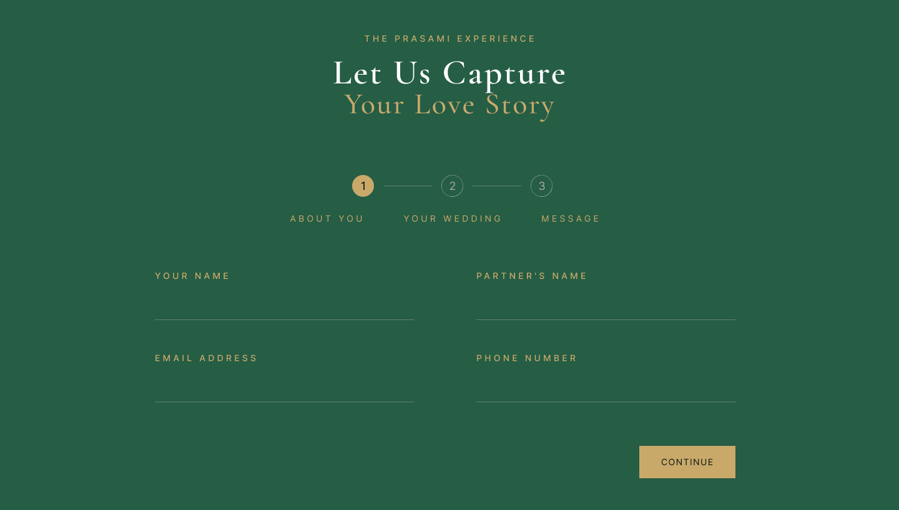

---

# 📱 Mobile Design

The mobile experience is designed to provide the same cinematic storytelling experience within a compact and touch-friendly interface.

### Mobile Highlights

- Responsive mobile navigation
- Hamburger menu
- Optimized typography
- Full-width imagery
- Stacked content sections
- Touch-friendly buttons
- Simplified layouts
- Easy access to booking
- Mobile-first content hierarchy

### Mobile Screens

#### 🏠 Home Page

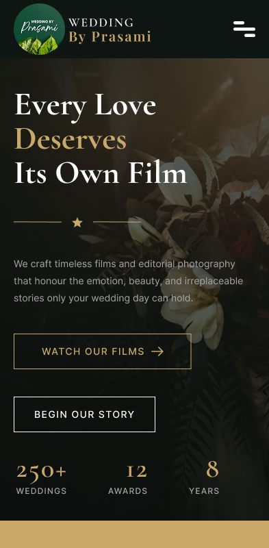

#### 🎥 Films

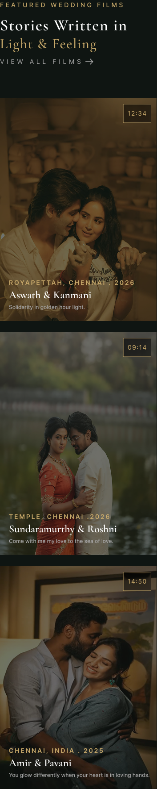

#### 📸 Gallery

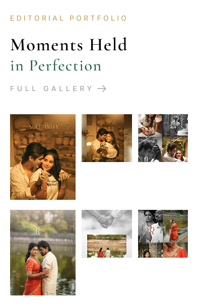

#### ❤️ Stories

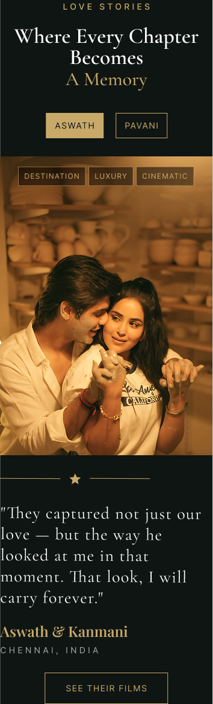

#### ✨ Experience

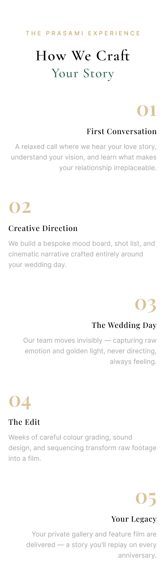

#### 📦 Packages

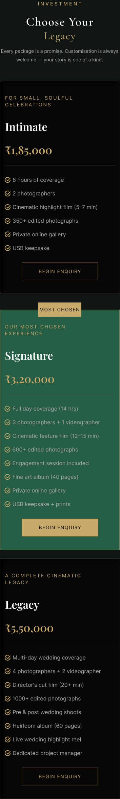

#### 📅 Contact

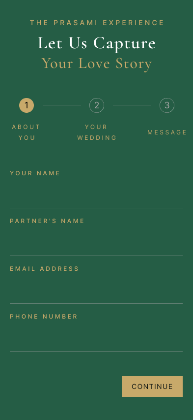

---

## 📱 Responsive Design

The website was designed for:

- Desktop
- Laptop
- Tablet
- Mobile

The responsive design maintains consistent branding, typography, visual hierarchy, and user experience across different screen sizes.

## 🎨 Design Highlights

- Cinematic visual style
- Premium wedding photography aesthetic
- Dark background with warm gold accents
- Elegant typography
- Strong visual hierarchy
- Large cinematic imagery
- Smooth storytelling flow
- Responsive layouts
- Clear CTA buttons
- Consistent spacing and components
- User-friendly booking experience

## 🛠️ Tools Used

- Figma
- Framer
- Canva

## 🔗 Figma Design & Prototype

🚀 **[View Interactive Prototype](https://www.figma.com/proto/QJ4ioZSLP0nE1yWHx4cgN6/Wedding-By-Prasami?node-id=160-692&p=f&t=jOVigp1XT8bqL30x-1&scaling=min-zoom&content-scaling=fixed&page-id=0%3A1&starting-point-node-id=160%3A692)**

🎨 **[View Figma Design](https://www.figma.com/design/QJ4ioZSLP0nE1yWHx4cgN6/Wedding-By-Prasami?node-id=0-1&t=0A9bAKkgPrlMIcNr-1)**

## 💡 Project Outcome

The final design provides Wedding By Prasami with a premium and cinematic digital experience that combines visual storytelling, wedding portfolio presentation, responsive design, and a clear booking journey.

The project includes both desktop and mobile experiences, ensuring users can explore wedding films, photography, stories, packages, and booking options seamlessly across devices.

## 👨‍💻 Designed By

**Sanjai S**

UI/UX Designer

### Skills Demonstrated

- UI/UX Design
- Responsive Web Design
- Wireframing
- Prototyping
- Visual Design
- Design Systems
- Figma
- User Experience Design
- Interaction Design

---

**Project Type:** UI/UX Design Case Study  
**Industry:** Wedding Photography & Filmmaking  
**Platform:** Desktop + Mobile Responsive Web  
**Design Tool:** Figma
